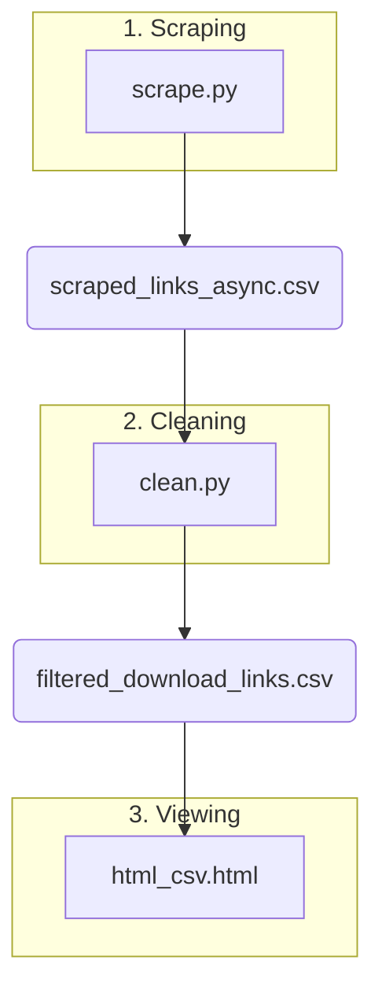

# Kitsune: Blog Link Scraper & Viewer

[](https://www.python.org/downloads/)
[](https://github.com/astral-sh/uv)
[](https://github.com/psf/black)

This repository contains a set of Python scripts and an HTML viewer designed to scrape all links from a blog, filter them to find potential download links, and display the results in a clean, user-friendly interface.

The project is a complete, three-stage workflow:
1.  **Scrape (`scrape.py`):** Asynchronously fetches all post URLs from a blog's sitemap and scrapes every link from each page.
2.  **Clean (`clean.py`):** Uses the high-performance Polars library to process the raw scraped data, filtering out unwanted links based on a comprehensive ignore list.
3.  **Visualize (`html_csv.html`):** An interactive, browser-based tool to load the final CSV and view the cleaned links, neatly grouped by their original blog post.

## The Workflow

The entire process is designed to be linear and easy to follow. Each script generates an output file that becomes the input for the next step.



## Features

-   **Asynchronous Scraping:** Uses `httpx` and `asyncio` for fast, concurrent scraping of hundreds of pages without getting blocked.
-   **Powerful Filtering:** Leverages `polars` for high-speed data manipulation and regex-based filtering to remove unwanted links (internal links, social media, ad-fly, etc.).
-   **Interactive Viewer:** A zero-dependency (besides your browser) HTML file that parses and displays the final data in a clean, card-based layout.
-   **Easy Dependency Management:** Uses `uv`, the extremely fast Python package installer and resolver.
-   **Highly Customizable:** Easily change the target sitemap, fine-tune the ignore list, and adjust scraping performance settings.

## Prerequisites

Before you begin, ensure you have the following installed:
-   [Python 3.12](https://www.python.org/downloads/) or newer.
-   [uv](https://github.com/astral-sh/uv), the fast Python package manager. You can install it with:
    ```bash
    # On macOS and Linux
    curl -LsSf https://astral.sh/uv/install.sh | sh

    # On Windows
    irm https://astral.sh/uv/install.ps1 | iex
    ```

## Installation & Setup

1.  **Clone the repository:**
    ```bash
    git clone <your-repo-url>
    cd <your-repo-directory>
    ```

2.  **Install dependencies using `uv`:**
    This command creates a virtual environment and installs all the packages listed in `pyproject.toml` from the `uv.lock` file, ensuring a reproducible setup.
    ```bash
    uv sync
    ```

That's it! Your environment is ready.

## How to Use

Run the scripts in order. The magic of `uv` is that you don't even need to manually activate the virtual environment! `uv run` handles it for you.

### Step 1: Scrape the Raw Links

This script reads the sitemap, finds all post URLs, and scrapes every single link from them. This may take a few minutes depending on the number of posts.

```bash
uv run python scrape.py
```

-   **Input:** `SITEMAP_URL` defined inside `scrape.py`.
-   **Output:** A new file named `scraped_links_async.csv` containing the raw, unfiltered data.

### Step 2: Clean the Scraped Data

This script takes the raw data and applies the filtering rules from the `IGNORE_LIST`.

```bash
uv run python clean.py
```

-   **Input:** `scraped_links_async.csv`.
-   **Output:** A new file named `filtered_download_links.csv` containing only the relevant links.

### Step 3: View the Results

Now you can visualize the clean data.

1.  Open the `html_csv.html` file in your web browser (e.g., Chrome, Firefox, Safari).
2.  Click the "Choose File" button.
3.  Select the `filtered_download_links.csv` file you just created.

The page will instantly populate with cards, each representing a blog post, listing all the potential download links found within it.


## Customization

This project is designed to be easily adapted for other blogs or different filtering needs.

### Changing the Target Blog (`scrape.py`)

To scrape a different blog, simply change the `SITEMAP_URL` variable in `scrape.py`:

```python
# scrape.py

# The sitemap URL for the blogspot blog
SITEMAP_URL = "https://some-other-blog.blogspot.com/sitemap.xml"
```

You can also adjust the `CONCURRENCY_LIMIT` and `RANDOM_DELAY_RANGE` to be more or less aggressive in your scraping.

### Refining the Filter (`clean.py`)

The most powerful customization is in the `clean.py` script. The `IGNORE_LIST` contains a list of strings. Any link containing one of these strings will be removed.

To **add a new domain or pattern to ignore**, just add it to the list:

```python
# clean.py

IGNORE_LIST = [
    # ... existing rules
    "elrincondelkitsune.blogspot.com",
    "blogger.com",
    "google.com",

    # Add your new rule here, for example:
    "some-other-unwanted-site.com",
    "specific-page.html", # Can also be a partial URL
]
```

## File Breakdown

-   `pyproject.toml`: Project definition file, listing dependencies for `uv`.
-   `uv.lock`: A lockfile generated by `uv` for reproducible installations.
-   `scrape.py`: The first step. Asynchronously scrapes a blog's sitemap for all links.
-   `clean.py`: The second step. Filters the raw links using Polars and a comprehensive ignore list.
-   `html_csv.html`: The final step. A local webpage to visualize the filtered CSV data.
-   `read.py`: A simple utility script to quickly test-read the final CSV in the terminal.
-   `README.md`: This file.

## Core Dependencies

-   [**httpx**](https://www.python-httpx.org/): A modern, async-capable HTTP client used for all network requests in `scrape.py`.
-   [**BeautifulSoup4**](https://www.crummy.com/software/BeautifulSoup/): Used to parse HTML and extract links from the scraped pages.
-   [**Polars**](https://pola.rs/): An extremely fast DataFrame library (written in Rust) used in `clean.py` for efficient data cleaning and filtering.
-   [**tqdm**](https://github.com/tqdm/tqdm): Provides a simple and elegant progress bar for the asynchronous scraping process.